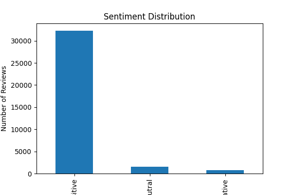
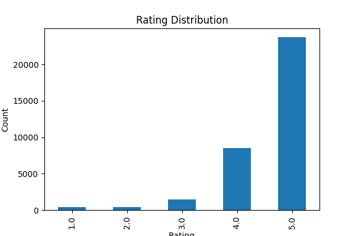
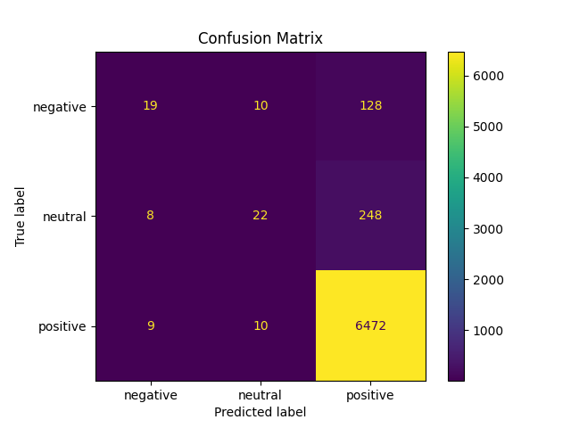
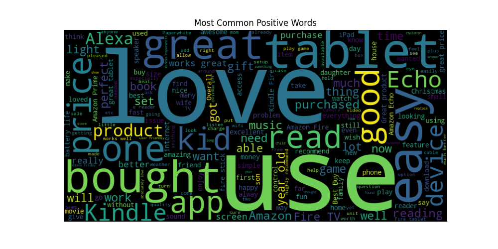
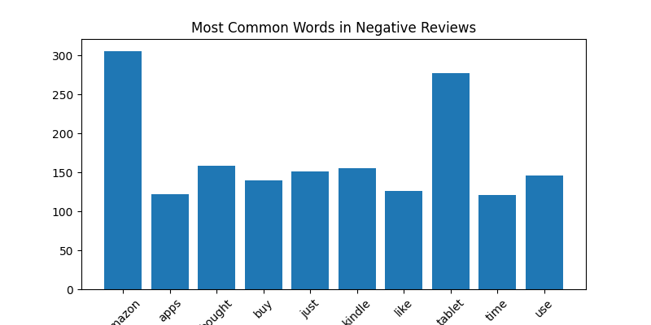

# Amazon Product Review Sentiment Analysis using NLP and Machine Learning

## Project Overview

This project performs **sentiment analysis** on Amazon product reviews using **Natural Language Processing (NLP)** and **Machine Learning**. Customer reviews are classified into **Positive**, **Neutral**, or **Negative** sentiments based on their textual content.

The project demonstrates an end-to-end machine learning workflow, including data preprocessing, feature engineering, model training, evaluation, visualization, and interactive sentiment prediction.

---

## Objectives

* Analyze customer reviews from an Amazon product reviews dataset.
* Convert numerical ratings into sentiment labels.
* Build and evaluate a machine learning model for sentiment classification.
* Visualize customer review patterns.
* Predict the sentiment of new user-provided reviews.

---

## Dataset

The project uses an Amazon Product Reviews dataset containing customer reviews and ratings.

### Features Used

| Feature        | Description          |
| -------------- | -------------------- |
| reviews.text   | Customer review text |
| reviews.rating | Product rating (1–5) |

### Sentiment Labels

| Rating | Sentiment |
| ------ | --------- |
| 1–2    | Negative  |
| 3      | Neutral   |
| 4–5    | Positive  |

---

## Technologies Used

* Python
* Pandas
* NumPy
* Scikit-learn
* Matplotlib
* WordCloud
* Joblib

---

## Machine Learning Workflow

1. Data Loading
2. Data Cleaning
3. Missing Value Handling
4. Sentiment Label Generation
5. Train-Test Split
6. TF-IDF Feature Extraction
7. Logistic Regression Model Training
8. Model Evaluation
9. Interactive Sentiment Prediction
10. Visualization Generation

---

## Model

**Algorithm**

* Logistic Regression

**Feature Extraction**

* TF-IDF Vectorizer

---

## Model Evaluation

Evaluation metrics include:

* Accuracy
* Precision
* Recall
* F1-Score
* Classification Report
* Confusion Matrix

**Overall Accuracy:** **~94%**

> **Note:** The dataset is imbalanced, resulting in stronger performance for positive reviews than for neutral and negative reviews.

---

## Sample Prediction

**Input**

```text
This product is amazing and works perfectly.
```

**Output**

```text
Positive
```

---

# Project Visualizations

## Sentiment Distribution



## Rating Distribution



## Confusion Matrix



## Positive Review Word Cloud



## Most Common Words in Negative Reviews



---

## Project Structure

```text
Amazon-Review-Sentiment-Analysis/
│
├── data/
│   └── amazon_reviews.csv
│
├── images/
│   ├── sentiment_distribution.png
│   ├── rating_distribution.png
│   ├── confusion_matrix.png
│   ├── positive_wordcloud.png
│   └── negative_keywords.png
│
├── models/
│   └── sentiment_model.pkl
│
├── src/
│   └── train_model.py
│
├── README.md
├── requirements.txt
├── LICENSE
└── .gitignore
```

---

## Installation

Clone the repository:

```bash
git clone https://github.com/pragyaguptastats/amazon-sentiment-analysis.git
```

Move into the project directory:

```bash
cd amazon-sentiment-analysis
```

Install dependencies:

```bash
pip install -r requirements.txt
```

Run the project:

```bash
python src/train_model.py
```

---

## Future Improvements

* Compare additional machine learning algorithms such as Naïve Bayes, Support Vector Machine, and Random Forest.
* Deploy the model using Streamlit.
* Integrate real-time review retrieval.
* Explore transformer-based models such as BERT.
* Build an interactive sentiment analytics dashboard.

---

## Skills Demonstrated

* Data Cleaning
* Exploratory Data Analysis (EDA)
* Natural Language Processing (NLP)
* Text Preprocessing
* Feature Engineering
* Machine Learning
* Model Evaluation
* Data Visualization
* Python Programming

---

## Author

**Pragya Gupta**

M.Sc. Statistics, University of Delhi

Interested in Data Analytics, Machine Learning, Statistical Modeling, and Business Analytics.

